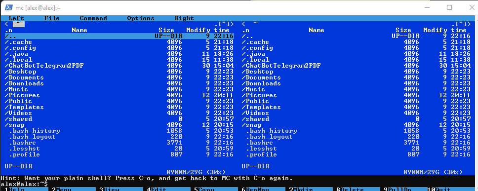
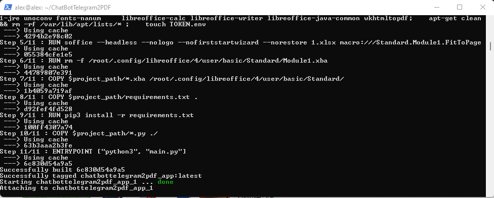

## Условие

* Установить Ubuntu Desktop 22.04 в виртуальную машину.
* Установить гостевые дополнения ОС.Установить Midnight Commander.
* Установить SSH-соединение с виртуальной машиной из хостовой.

## Результат

* Скриншот SSH-подключения к установленной системе с запущенным mc.

